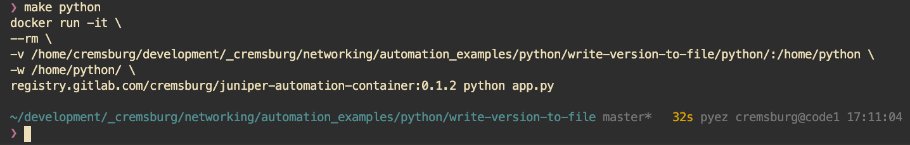

# Juniper PyEZ Example: Retrieve Version from multiple devices

This example will show how to use PyEZ to 

1. create a list of devices
2. build a NETCONF connection to the first device in the list
3. execute the RPC command of `get-software-information`
4. append the output to an empty list called `list_of_device_output`
5. repeat the process for remaining devices in list
6. print the object `list_of_device_output` to the screen

## 🚀 `Executing the script`

This project provides two unique methods of executing the script:

1. Docker
2. Your own Python environment

### 🐳 `Docker`

1. build the container image with

```sh
make container
```

2. run the playbook within the container

```sh
make python
```

#### 〰️ `Notes about Docker`

If you are unsure if Docker is installed on your computer, then it's probably safe to suggest that it's not. If you're interested in learning more about the product, I encourage you to read a few blogs on the topic. A personal recommendation would be [Digital Ocean](https://www.digitalocean.com/community/tutorial_collections/how-to-install-and-use-docker#:~:text=Docker%20is%20an%20application%20that,on%20the%20host%20operating%20system.)

Some of the goodies placed in the `docker` folder are not relevant to our use case with Python. Feel free to delete them as you see fit, I simply wanted to share with you my Docker build process for all Juniper automation projects (including those based on Ansible). The world is your oyster and I won't judge you on whatever direction you take.

### 🐍 `Your own Python environment`

1. install python dependencies 

```sh
pip install -r docker/requirements.txt
```

2. change into Python directory 

```
cd python
```

3. type in your terminal

```sh
python app.py
```

#### 〰️ `Notes about Python Virtual Environments`

Similar to Docker, if you are unsure if you're using Python Virtual Environment features, it is safe to suggest that you're not. You are *strongly* recommended to using a Python Virtual Environment everywhere. You can really mess up your machine if you're too lazy and say "ehh, that seems like it's not important". It is. If it sounds like I'm speaking from experience, well I'll never admit to it.

If you're interested in learning more about setting up Virtual Environments, I encourage you to read a few blogs on the topic. A personal recommendation would be

- [Digital Ocean (macOS)](https://www.digitalocean.com/community/tutorials/how-to-install-python-3-and-set-up-a-local-programming-environment-on-macos)
- [Digital Ocean (Windows 10)](https://www.digitalocean.com/community/tutorials/how-to-install-python-3-and-set-up-a-local-programming-environment-on-windows-10)

## 📝 `Dependencies`

Refer to the file located at [docker/requirements.txt](docker/requirements.txt)

## ⚙️ `How it works`

Let's take a second to do a nice John Madden play-by-play on this script:

```python
from jnpr.junos import Device
from pprint import pprint
import json

devices = [
        "dallas-fw0",
        "austin-fw0",
        "houston-fw0"
    ]


def write_to_file(device, payload):
    # Open function to open the file "hostname.py" 
    # (same directory) in append mode 
    filename = f"./output/{device}.py"
    file1 = open(filename,"a")
    file1.write(str(payload) + "\n")
    file1.close()
    pass


for device in devices:
    with Device(host=device, user='automation', password='juniper123') as dev:
        try:
            show_version = dev.rpc.get_software_information({'format':'json'})
            write_to_file(device, show_version)
        except:
            pass
```

- We need to import the PyEZ package into our script
- Specifically, we are looking to import the `Device` method from the base `jnpr.junos` package
- `Device` will help us manage our SSH/NETCONF connection to the remote device

```python
from jnpr.junos import Device
```

- To help us work with the `json` data format, we will import the `json` package
- To help make the output stand out a little more, we will import the `pretty-print` package

```python
from pprint import pprint
import json
```

- our first task is to build a list of devices for us to interface with
- This list is using DNS records to resolve hostnames
- you may use IP addresses if you're not cool enough to run DNS in your home

```python
inventory = [
        "dallas-fw0",
        "houston-fw0",
        "austin-fw0"
    ]
```

- this one may look like a headscratcher, but hear me out
- creating an empty list here allows us to have something to store the output from our devices into

```python
list_of_device_output = []
```

- now let's begin our loop over the inventory list

```python
for each_hostname in inventory:
    ...
    ...
```


- Our goal now is to build the SSH connection to the first device in our list.
- We reference the object name from our `for loop` above, in this case `each_hostname`
- We create a new Python object called `network_device`, based on the parameters passed into the `Device` class

```python
    with Device(host=each_hostname, user='automation', password='juniper123') as network_device:
        ...
        ...
```

- by using the `try/exempt` feature in Python, we can enable our script to handle exception errors easily.
- here we tell Python to "try to do this code, but if you get an exemption, go about your day"
- the code we're running in `try/exempt` is making a remote proceedure call (RPC) for the routing table

```python
    try:
        ...
        ...
    except:
        pass
```

- we pass an argument into the request, asking for the return payload be structured in JSON
- the resulting output from the RPC is stored in a new object called `show_version`
- we create a new Python dictionary that has a key/value pair of the device's hostname alongside the payload
- we can later use this new `payload` structure to understand which device the output came from

```python
            show_version = network_device.rpc.get_software_information({'format':'json'})
            write_to_file(device, show_version)
```

- we then run the output through our function named `write_to_file`, let's look into that function
- we declare a new object called `filename` and set the value the path of `output/` and the hostname of the device.
- this `filename` object will be the path of where the output is written
- using the `open()` method with `a` allows us to append to an existing file
- using the `write()` method, we dump the output of our script into the file and close it

```python
def write_to_file(device, payload):
    # Open function to open the file "hostname.py" 
    # (same directory) in append mode 
    filename = f"./output/{device}.py"
    file1 = open(filename,"a")
    file1.write(str(payload) + "\n")
    file1.close()
    pass
```

## 📸 `Screenshot`


